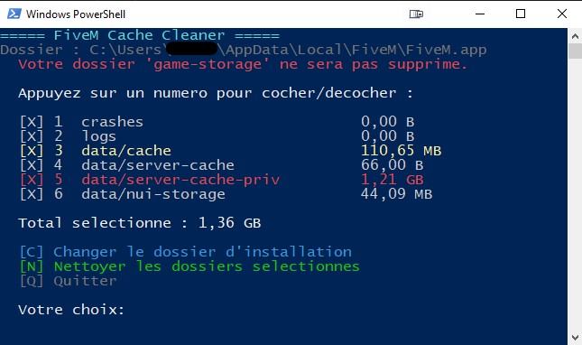
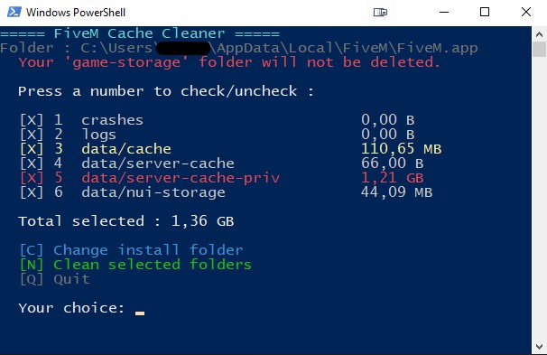

# 🧹 FiveM Cache Cleaner

---

## 🇫🇷 Français

### Description
Script PowerShell permettant de nettoyer facilement les dossiers de cache de FiveM.  
Aucune installation requise, aucune connexion réseau, aucune modification du registre Windows.  
Le script supprime uniquement les dossiers sélectionnés par l'utilisateur.

### Dossiers nettoyables
| Dossier | Description |
|---|---|
| `crashes` | Rapports de crash |
| `logs` | Fichiers journaux |
| `data/cache` | Cache principal |
| `data/server-cache` | Cache serveur |
| `data/server-cache-priv` | Cache serveur privé |
| `data/nui-storage` | Stockage NUI |

> ⚠️ Le dossier `data/game-storage` n'est jamais supprimé.

### Fonctionnalités
- Détection automatique du dossier d'installation FiveM
- Prise en charge des installations personnalisées (dossier modifiable)
- Affichage de la taille de chaque dossier avant suppression
- Détection et fermeture automatique de FiveM si ouvert
- Interface en français par défaut — anglais disponible via [L] sur PC non-français
- Mémorisation du chemin d'installation entre les sessions

### Utilisation
1. Télécharge `FiveM-Cache-Cleaner.ps1` depuis la page [Releases](https://github.com/MrHeeks/FiveM-Cache-Cleaner/releases)
2. Fais un **clic droit** sur le fichier → **Exécuter avec PowerShell**
3. Sélectionne les dossiers à nettoyer et appuie sur `[N]`

> 💡 Si Windows bloque l'exécution, fais clic droit → Propriétés → coche "Débloquer" en bas de la fenêtre.

### Compatibilité
- Windows 10 / 11
- PowerShell 5.1 (inclus par défaut sur Windows 10/11)

## 📸 Preview

---

## 🇬🇧 English

### Description
A PowerShell script to easily clean FiveM cache folders.  
No installation required, no network connection, no Windows registry modification.  
The script only deletes folders selected by the user.

### Cleanable folders
| Folder | Description |
|---|---|
| `crashes` | Crash reports |
| `logs` | Log files |
| `data/cache` | Main cache |
| `data/server-cache` | Server cache |
| `data/server-cache-priv` | Private server cache |
| `data/nui-storage` | NUI storage |

> ⚠️ The `data/game-storage` folder is never deleted.

### Features
- Automatic detection of the FiveM installation folder
- Support for custom installations (editable folder path)
- Display of each folder size before deletion
- Automatic detection and closing of FiveM if running
- Interface in English by default — French available via [L]
- Installation path saved between sessions

### Usage
1. Download `FiveM-Cache-Cleaner.ps1` from the [Releases](https://github.com/MrHeeks/FiveM-Cache-Cleaner/releases) page
2. **Right-click** the file → **Run with PowerShell**
3. Select the folders to clean and press `[N]`

> 💡 If Windows blocks execution, right-click → Properties → check "Unblock" at the bottom of the window.

### Compatibility
- Windows 10 / 11
- PowerShell 5.1 (included by default on Windows 10/11)

## 📸 Preview

---

## 🤝 Contributing

Contributions are welcome — feel free to open an issue or submit a pull request.  
If you want to improve a translation or add a feature, go ahead!

---

## 📄 License

MIT — see [LICENSE](./LICENSE) for details.
